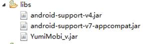
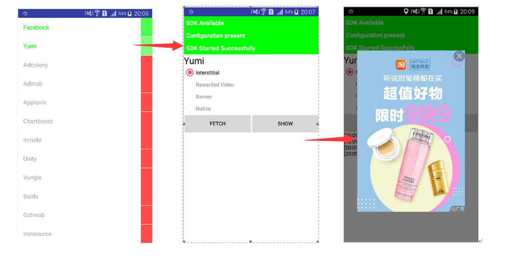
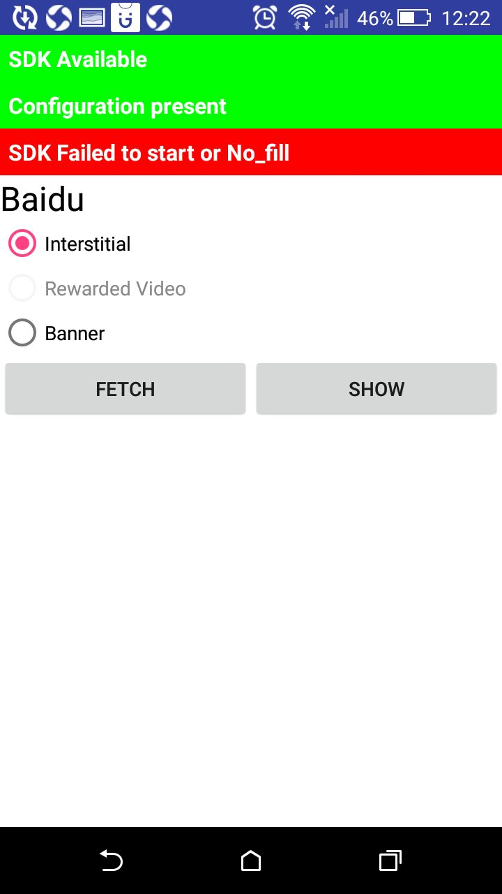

   * [YumiMediationSDK Android](#yumimediationsdk-android)
      * [1. Overview](#1-overview)
         * [1.1 Target Readers](#11-target-readers)
         * [1.2 Development Environment](#12-development-environment)
      * [2. Development Environment Configuration](#2-development-environment-configuration)
         * [2.1 Android Studio](#21-android-studio)
         * [2.2 Eclipse](#22-eclipse)
      * [3. Integration](#3-integration)
         * [3.1 Banner](#31-banner)
            * [3.1.1 Initialization and request](#311-initialization-and-request)
            * [3.1.2 Destroy](#312-destroy)
            * [3.1.3 Add Listener](#313-add-listener)
            * [3.1.4 Other methods](#314-other-methods)
         * [3.2 Interstitial](#32-interstitial)
            * [3.2.1 Initialization and request](#321-initialization-and-request)
            * [3.2.2 Display and Destroy](#322-display-and-destroy)
            * [3.2.3 Add Listener](#323-add-listener)
            * [3.2.4 Other methods](#324-other-methods)
         * [3.3 Rewarded Video](#33-rewarded-video)
            * [3.3.1 Initialization and request](#331-initialization-and-request)
            * [3.3.2 Display and Destroy](#332-display-and-destroy)
            * [3.3.3 Add Listener](#333-add-listener)
            * [3.3.4 Other methods](#334-other-methods)
         * [3.4 Splash](#34-splash)
            * [3.4.1 Initialization and request](#341-initialization-and-request)
            * [3.4.2 Add Listener](#342-add-listener)
            * [3.4.3 Other methods](#343-other-methods)
         * [3.5 Native](#35-native)
            * [3.5.1 Initialization and request](#351-initialization-and-request)
            * [3.5.2 Add litener](#352-add-litener)
            * [3.5.3 Display ad](#353-display-ad)
            * [3.5.4 Other settings](#354-other-settings)
      * [4. Other settings](#4-other-settings)
         * [4.1 Proguard](#41-proguard)
         * [4.2 channelID and versionName](#42-channelid-and-versionname)
         * [4.3 GDPR](#43-gdpr)
            * [4.3.1 Set GDPR](#431-set-gdpr)
            * [4.3.2 Platform supporting GDPR](#432-platform-supporting-gdpr)
      * [5 Test Mode](#5-test-mode)
         * [5.1 Debug mode](#51-debug-mode)
         * [5.2 Test ad slot](#52-test-ad-slot)
      * [6 YumiMediationSDK Q&A](#6-yumimediationsdk-qa)


# YumiMediationSDK Android
## 1. Overview
### 1.1 Target Readers
This document is for Android developers who want to integrate YUMIMOBI advertising SDK into their product.
   
### 1.2 Development Environment
OS: Windows, Mac, Linux <br/>
Android SDK: > 4.4(API level 19)<br/>
IDE: Eclipse with ADT (ADT version 23.0.4) OR Android-Studio<br />
Java: > JDK 7

## 2. Development Environment Configuration
### 2.1 Android Studio

add YumiMediationSDK and other network adapters maven url to project's build.gradle

```groovy
buildscript {
    repositories {
        jcenter()
    }
}

allprojets {
    repositories {
    	jcenter()

        // Optional. It is required when you import SDKs related to Google Server.
        google()
        
        // Optional.
        // If you do not need the Innerative and bytedance SDK, you can remove the repo.
        maven { url "https://dl.bintray.com/yumimobi/thirdparty/" }
        maven { url "https://dl.bintray.com/yumimobi/ads/" }

        // Optional.
        // If you do not need the tapjoy SDK, you can remove the repo.
        maven { url "https://tapjoy.bintray.com/maven" }

        // Optional.
        // If you do not need the pubnative SDK, you can remove the repo.
        maven { url "https://dl.bintray.com/pubnative/maven" }
        
    }
}
```

add YumiMediationSDK and other adapters dependencies.

```groovy
dependencies {
    // YumiMediationSDK main package
    implementation 'com.yumimobi.ads:mediation:4.3.0'

    // YumiMediationSDK adapters, each adapter is one third party sdk.
    implementation 'com.yumimobi.ads.mediation:playableads:4.3.0'
    implementation 'com.yumimobi.ads.mediation:adcolony:4.3.0'
    implementation 'com.yumimobi.ads.mediation:admob:4.3.0'
    implementation 'com.yumimobi.ads.mediation:applovin:4.3.0'
    implementation 'com.yumimobi.ads.mediation:baidu:4.3.0'
    implementation 'com.yumimobi.ads.mediation:bytedance:4.3.0'
    implementation 'com.yumimobi.ads.mediation:chartboost:4.3.0'
    implementation 'com.yumimobi.ads.mediation:facebook:4.3.0'
    implementation 'com.yumimobi.ads.mediation:gdt:4.3.0'
    implementation 'com.yumimobi.ads.mediation:inmobi:4.3.0'
    implementation 'com.yumimobi.ads.mediation:inneractive:4.3.0'
    implementation 'com.yumimobi.ads.mediation:ironsource:4.3.0'
    implementation 'com.yumimobi.ads.mediation:ksyun:4.3.0'
    implementation 'com.yumimobi.ads.mediation:mintegral:4.3.0'
    // If you publish an app in China, you can use mintegral-china sdk
    // compile 'com.yumimobi.ads.mediation:mintegral-china:4.3.0'
    implementation 'com.yumimobi.ads.mediation:oneway:4.3.0'
    implementation 'com.yumimobi.ads.mediation:tapjoy:4.3.0'
    implementation 'com.yumimobi.ads.mediation:unity:4.3.0'
    implementation 'com.yumimobi.ads.mediation:vungle:4.3.0'
    implementation 'com.yumimobi.ads.mediation:pubnative:4.3.0'
｝
```

> [Click here](https://github.com/yumimobi/YumiMediationSDKDemo-Android#latest-version) get latest version number. 

> Platform adapter, [Click here](./YumiMediationSDK%20-%20Mediation%20List(en)%20.md) 

Optional permission.

```xml
<uses-permission android:name="android.permission.ACCESS_NETWORK_STATE" />
<uses-permission android:name="android.permission.ACCESS_WIFI_STATE" />
<uses-permission android:name="android.permission.MOUNT_UNMOUNT_FILESYSTEMS"/>
<uses-permission android:name="android.permission.ACCESS_FINE_LOCATION"/>
<uses-permission android:name="android.permission.ACCESS_COARSE_LOCATION" />
<uses-permission android:name="android.permission.DOWNLOAD_WITHOUT_NOTIFICATION" />
<!-- The Googleplay app can be unloaded -->
<uses-permission android:name="android.permission.WRITE_EXTERNAL_STORAGE" />
<!-- If no add READ_PHONE_STATE permission will affect the advertising earnings -->
<uses-permission android:name="android.permission.READ_PHONE_STATE"/>
```

 ### 2.2 Eclipse

Add library file to libs.

>[SDK Download](https://github.com/yumimobi/YumiMediationSDKDemo-Android/blob/master/docs/YumiMediationSDK%20for%20Android%20Download%20Page.md)

All lib files are placed in ..\YumiMobi_SDK_AndroidEclipse_Example\lib in the SDK:

- YumiMobi_Android_vX.X.X.jar

- android-support-v4.jar

- android-support-v7-appcompat.jar

- google_play_service 

Create libs folder under the root directory of your project,add YumiMobi_Android_vX.X.X.jar into libs.



you can choose to or not to add android-support-v4.jar and/or android-support-v7-appcompat.jar into libs according to your needs. You must use the jar file provided by YUMIMOBI when you need to use v4.jar or v7.jar.

<div style="background-color:rgb(228,244,253);padding:10px;">
<span style="color:rgb(62,113,167);">About google_play_service project: google_play_service is not mandatory, while some ad platforms need it. YUMIMOBI does not need google_play_service. You need use it as a library and import it into your project. Also, add the ollowing code in tab <application> of your manifest.xml.</span></div>
<br/>

```xml
<meta-data 
    android:name="com.google.android.gms.version"
    class="kix-line-break"
    android:value="@integer/google_play_services_version" />
```

Registered components

Add following in manifest.xml of your project:

```xml
    <receiver android:name="com.yumi.android.sdk.ads.self.module.receiver.ADReceiver">
        <intent-filter>
            <action android:name="android.intent.action.DOWNLOAD_COMPLETE" />
        </intent-filter>
    </receiver>

    <activity
        android:name="com.yumi.android.sdk.ads.self.activity.YumiFullScreenActivity"
        android:configChanges="keyboardHidden|orientation|screenSize"
        android:theme="@android:style/Theme.NoTitleBar.Fullscreen" />

    <activity
        android:name="com.playableads.presenter.APIAdActivity"
        android:configChanges="keyboardHidden|orientation|screenSize"
        android:theme="@android:style/Theme.NoTitleBar.Fullscreen" />

    <activity
        android:name="com.playableads.presenter.PlayableADActivity"
        android:configChanges="orientation|screenSize|keyboardHidden"
        android:hardwareAccelerated="true"
        android:screenOrientation="portrait"
        android:theme="@android:style/Theme.NoTitleBar.Fullscreen" />

    <activity
        android:name="com.playableads.presenter.NativeAdLandingPageActivity"
        android:configChanges="orientation|screenSize|keyboardHidden"
        android:hardwareAccelerated="true"
        android:screenOrientation="portrait"
        android:theme="@android:style/Theme.NoTitleBar.Fullscreen" />

    <activity
        android:name="com.playableads.presenter.WebActivity"
        android:configChanges="orientation|screenSize|keyboardHidden"
        android:hardwareAccelerated="true"
        android:theme="@android:style/Theme.NoTitleBar.Fullscreen" />

    <receiver android:name="com.playableads.PlayableReceiver">
        <intent-filter>
            <action android:name="android.intent.action.DOWNLOAD_COMPLETE" />
        </intent-filter>
    </receiver>
        
    <activity android:name="com.yumi.android.sdk.ads.mediation.activity.MediationTestActivity" />
```

Add permissions 

- Add the following permissions in manifest.xml of your project:

```xml
<uses-permission android:name="android.permission.INTERNET"/>
<uses-permission android:name="android.permission.ACCESS_NETWORK_STATE" />
<!--The Googleplay app can be unloaded-->
<uses-permission android:name="android.permission.WRITE_EXTERNAL_STORAGE" />
```

- Optional permission


```xml
<uses-permission android:name="android.permission.ACCESS_NETWORK_STATE" />
<uses-permission android:name="android.permission.ACCESS_WIFI_STATE" />
<uses-permission android:name="android.permission.MOUNT_UNMOUNT_FILESYSTEMS"/>
<uses-permission android:name="android.permission.ACCESS_FINE_LOCATION"/>
<uses-permission android:name="android.permission.ACCESS_COARSE_LOCATION" />
<uses-permission android:name="android.permission.DOWNLOAD_WITHOUT_NOTIFICATION" />

<!-- If no add READ_PHONE_STATE permission will affect the advertising revenue -->
<uses-permission android:name="android.permission.READ_PHONE_STATE"/>
```

## 3. Integration

### 3.1 Banner

#### 3.1.1 Initialization and request
```java
// Creates a YumiBanner object
//
// activity: your banner view will add to the activity.
// YOUR_SLOT_ID: ad unit id or placement id, created with the YumiMediation platform
// auto: Whether to automatically load the next ad
//  - true: Automatically request and display the next banner after the banner has failed to load or show for a certain amount of time
//  - false: Do not automatically load the next ad, you need to call the requestYumiBanner() method again to display the next one.
YumiBanner banner = new YumiBanner(activity， "YOUR_SLOT_ID"， auto);

// Must pass the base information by the setBannerContainer method to the SDK, otherwise there will be no ad to load.
// 
// bannerContainer: ad coantiner(ViewGroup), Ad content will be filled in this container. The SDK will adjust the size of the incoming container according to the screen size. For example, if the width of the incoming container exceeds the width of the screen, it will automatically reduce the width of the container and adjust the height of the container accordingly.
// AdSize: Banner style. The SDK will adjust the container size according to the style, there are 4 styles, as followed
//  - BANNER_SIZE_AUTO：The SDK resizes the container according to the screen size. If it detects that the device is a mobile phone, set the container size to 320 * 50; if the device is a tablet, set the container size to 728 * 90
//  - BANNER_SIZE_SMART：Currently, only AdMob supports SMART Banner in the three-party network, and other networks directly return no ads. Please refer to AdMob SMART_BANNER for details.
//  - BANNER_SIZE_320X50：The SDK sets the container to 320*50 size
//  - BANNER_SIZE_728X90：The SDK sets the container to 728*90 size
// isMatchWindowWidth: True means that the container is expanded to the same width as the screen (valid only in portrait), with a height to width ratio of 1:8 (BANNER_SIZE_728X90) or 1:6.4 (non-BANNER_SIZE_728X90)
banner.setBannerContainer(bannerContainer, AdSize.BANNER_SIZE_AUTO, isMatchWindowWidth);

// Request a banner ad, if the auto property is set to true, then you only need to call this method once.
banner.requestYumiBanner();
```

#### 3.1.2 Destroy

```java
banner.destroy();
```

Deleting the banner object when it is no longer necessary to display , the banner is recommended to be destroyed in the Activity `onDestroy()` life callback. If you just want to temporarily hide the Banner ad, you can call the `dismissBanner()` method and call the `resumeBanner()` method to redisplay the ad when it needs to be displayed again.

#### 3.1.3 Add Listener

If you need to listen for banner ad method callbacks, after creating the YumiBanner object, call the following method

```java
banner.setBannerEventListener(iYumiBannerListener);
```

The IYumiBannerListener interface is defined as follows

```java
interface IYumiBannerListener {
    // This method is fired when the ad is loaded
    void onBannerPrepared();
    // This method is fired when the ad fails to load, print adError to view the error details
    void onBannerPreparedFailed(AdError adError);
    // This method is fired when the ad is displayed on the screen
    void onBannerExposure();
    // This method is fired when an ad is clicked
    void onBannerClicked();
    // This method is fired when the ad is closed, and calling the dismissBanner() method does not trigger this method.
    void onBannerClosed();
};
```

#### 3.1.4 Other methods
```java
// hide banner
banner.dismissBanner();
// Restore display banner
banner.resumeBanner();
```

### 3.2 Interstitial

#### 3.2.1 Initialization and request

```java
// Create a YumiInterstitial object.
// 
// activity: Interstitial will appear in this activity
// YOUR_SLOT_ID: ad unit id or placement id, created with the YumiMediation platform
// auto: Whether to automatically load the next ad
//  - true: When the displaying ad ends or the ad fails to load, the SDK will automatically request the next ad at the appropriate time.
//  - false: When the ad has been displayed, the ad will not be automatically requested.
YumiInterstitial interstitial = new YumiInterstitial(activity， "YOUR_SLOT_ID"， auto);

// Request an ad, if the auto property is set to true, then you only need to call this method once.
interstitial.requestYumiInterstitial();
```

<div style="background-color:rgb(228,244,253);padding:10px;">
<span style="color:rgb(62,113,167);">
<b>Important:</b> When showing the ad, you must use the interstitial.onBackPressed() method to avoid the back key logic confusion. For example, when there is an ad being displayed, clicking the back button should close the ad instead of closing the current activity. Sample code is as follows
</span>
</div>
<br/>

```java
@Override
public void onBackPressed() {
    if (interstitial.onBackPressed()) {
        return;
    }
    super.onBackPressed();
}
```

#### 3.2.2 Display and Destroy

```java
// Display ad
interstitial.showInterstitial();
```

```java
// Destroy the ad instance
interstitial.destroy();
```

Calling the `destroy()` method only when you don't need to display the ad, it is recommended to call this method in the Activity `onDestroy()` life callback.

#### 3.2.3 Add Listener

If you need to listen to the ad method callback, after creating the YumiInterstitial object, call the following method

```java
interstitial.setInterstitialEventListener(iYumiInterstitialListener);
```

the IYumiInterstitialListener interface is defined as follows
```java
interface IYumiInterstitialListener {
    // This method is fired when the ad is loaded.
    void onInterstitialPrepared();
    // This method is fired when the ad fails to load, print adError to view the error details
    void onInterstitialPreparedFailed(AdError adError);
    // This method is fired when an ad appears on the screen
    void onInterstitialExposure();
    // This method is fired when an ad is clicked
    void onInterstitialClicked();
    // This method is fired when closing the ad
    void onInterstitialClosed();
    // This method is fired when the showInterstitial() method is called and failed to show an ad, print adError to view the error details
    void onInterstitialExposureFailed(AdError adError);
    // This method is fired when the video starts playing when the video is inserted in the ad. If there is no video in the screen, the method is fired after the advertisement is displayed.
    void onInterstitialStartPlaying();
}
```

#### 3.2.4 Other methods
```java
// Determine if an ad is available
interstitial.isReady();
```

### 3.3 Rewarded Video

#### 3.3.1 Initialization and request

```java
// Create a YumiMedia object.
//
// activity: Rewarded Video will displayed from the Activity
// YOUR_SLOT_ID: ad unit id or placement id, created with the YumiMediation platform
YumiMedia media = new YumiMedia(activity， "YOUR_SLOT_ID");

// Request a Rewarded Video, after the first call to this method, the ad will automatically request the next ad after the closure or request failure
media.requestYumiMedia();
```

#### 3.3.2 Display and Destroy

show Rewarded Video
```java
media.showMedia();
```

Destroy reward video object: Call the `destroy()` method only when you don't need to show reward video ads. It is recommended to call this method in the Activity `onDestroy()` life callback.

```java
media.destroy()
```

#### 3.3.3 Add Listener

If you need to listen to the Rewarded Video method callback, after creating the YumiMedia object, call the following method

```java
media.setMediaEventListener(iYumiMediaListener);
```

the IYumiMediaListener interface is defined as follows:

```java
interface IYumiMediaListener {
    // This method is fired when Rewarded Video is loaded.
    void onMediaPrepared();
    // This method is fired when the Rewarded Video fails to load. Print adError to view the error details.
    void onMediaPreparedFailed(AdError adError);
    // This method is fired when Rewarded Video is displayed to the screen.
    void onMediaExposure();
    // This method is fired when Rewarded Video does not successfully display the ad after calling the display method. Print adError to view the error details.
    void onMediaExposureFailed(AdError adError);
    // This method is fired when an ad is clicked
    void onMediaClicked();
    // This method is fired when Rewarded Video is closed. isRewarded indicates whether the reward should be issued. For example, if you choose to skip the advertisement during playback, this close event will also be fired. At this time, isRewarded is false, indicating that the reward should not be issued.
    void onMediaClosed(boolean isRewarded);
    // Rewarded Video rewarded callback, you should issue a reward at this time (this method as same as onMediaClosed (true) , to avoid repeating the award)
    void onMediaRewarded();
    // This method is fired when the video starts playing
    void onMediaStartPlaying();
}
```

#### 3.3.4 Other methods
```java
// Determine if there is a ready advertisement
media.isReady();
// Returns the remaining number of reward ads. If it is 0, it means that Rewarded Video will not be requested again today.
media.getMediaRemainRewards()
```

<div style="background-color:rgb(228,244,253);padding:10px;">
<span style="color:rgb(62,113,167);">
<b>Note:</b> Do not call the isReady() method frequently, it is recommended to call the interval for no less than 5 seconds.
</span>
</div>

### 3.4 Splash

#### 3.4.1 Initialization and request

```java
// Create a YumiSplash object
// 
// activity: The splash ad will appear in the adContainer container of this activity
// adContainer: Splash ad container (ViewGroup, it is recommended to use FrameLayout as the ad container), the ad will be displayed in this container
// YOUR_SLOT_ID: ad unit id or placement id, created with the YumiMediation platform
YumiSplash splash = new YumiSplash(activity, adContainer, "YOUR_SLOT_ID");

// Request and display an splash ad
splash.loadAdAndShowInWindow();
```

#### 3.4.2 Add Listener

To monitor the splash ad method callback, after creating the YumiSplash object, call the following method

```java
splash.setSplashListener(iYumiSplashListener);
```

The IYumiSplashListener interface is defined as follows

```java
interface IYumiSplashListener {
    // This method is fired when the ad is successful
    void onSplashAdSuccessToShow();
    // This method is fired when the ad fails to display successfully, print adError to view the error details
    void onSplashAdFailToShow(AdError adError);
    // This method is fired when clicking to open the screen
    void onSplashAdClicked();
    // This method is fired when the ad is closed
    void onSplashAdClosed();
}
```

#### 3.4.3 Other methods
```java
// Set the launch image to display this image during the loading of the splash ad
splash.setLaunchImage(drawable);
// Set the length of the request ad. The default is 3 seconds. If it is not loaded within 3 seconds, it will fired the failure callback directly. Here, 3 seconds is the approximate number.
splash.setFetchTime(seconds);
```

### 3.5 Native

#### 3.5.1 Initialization and request
```java
// Create a native ad option for custom style. The following is the default style. Details are discussed in latter.
YumiNativeAdOptions nativeAdOptions = new YumiNativeAdOptions.Builder().build();

// Create a YumiNative object
//
// activity: 
// YOUR_SLOT_ID: ad unit id or placement id, created with the YumiMediation platform
// nativeAdOptions: style config object
YumiNative nativeAd = new YumiNative(activity, "YOUR_SLOT_ID", nativeAdOptions);

// load ad
// 
// adCount: The number of native ads loaded this time
nativeAd.requestYumiNative(adCount); 
```

#### 3.5.2 Add litener
To listen to the native ad callback method, after creating the YumiNative object, call the following method
```java
nativeAd.setNativeEventListener(iYumiNativeListener);
```

The IYumiNativeListener interface is defined as follows
```java
interface IYumiNativeListener {
    // This method is fired when the native ad is loaded
    void onLayerPrepared(List<NativeContent> adList);
    // This method is fired when the native ad fails to load, print adError to view the error details
    void onLayerFailed(AdError adError);
    // This method is fired when a native ad is clicked
    void onLayerClick();
    // This method is fired when a ExpressAdView render failed(only gdt ExpressAdView could callback it).
    void onExpressAdRenderFail(NativeContent content, String errorMsg);
    // This method is fired when ExpressAdView render success(only gdt ExpressAdView could callback it).
    void onExpressAdRenderSuccess(NativeContent content);
    // This method is fired when ExpressAdView closed(only gdt ExpressAdView could callback it).
    void onExpressAdClosed(NativeContent content);
}
```

#### 3.5.3 Display ad

* YumiNativeAdView class：

For the YumiNativeAdView format, there is the corresponding YumiNativeAdView class. This class is a ViewGroup that publishers should use as the root for the YumiNativeAdView. A single YumiNativeAdView corresponds to a single unified native ad. Each view used to display that ad's assets should be a child of the YumiNativeAdView object.

1、The view hierarchy for a unified native ad that uses a LinearLayout to display its asset views might look like this：

```xml
<?xml version="1.0" encoding="utf-8"?>
<com.yumi.android.sdk.ads.formats.YumiNativeAdView xmlns:android="http://schemas.android.com/apk/res/android"
    android:layout_width="match_parent"
    android:layout_height="wrap_content">
<LinearLayout xmlns:android="http://schemas.android.com/apk/res/android"
    android:layout_width="match_parent"
    android:layout_height="wrap_content"
    android:layout_gravity="center"
    android:background="#FFFFFF"
    android:minHeight="50dp"
    android:orientation="vertical">
    <LinearLayout
        android:layout_width="match_parent"
        android:layout_height="wrap_content"
        android:orientation="vertical"
        android:paddingLeft="20dp"
        android:paddingRight="20dp"
        android:paddingTop="12dp">
        <LinearLayout
            android:orientation="horizontal"
            ...>
            <ImageView
                android:id="@+id/app_icon"
                .../>
            <LinearLayout
                android:orientation="vertical"
                ...>
                <TextView
                    android:id="@+id/headline"
                    .../>
                <RatingBar
                    android:id="@+id/stars"
                     .../>
            </LinearLayout>
        </LinearLayout>
        // Other assets such as image or media view, call to action, etc follow.
        ...
    </LinearLayout>
</LinearLayout>
</com.yumi.android.sdk.ads.formats.YumiNativeAdView>
```
2、Here is an example code snippet that creates a YumiNativeAdView and populates it with a NativeContent：

```java
private void showNativeAd() {
    // determine if the ad returned by the native callback onLayerPrepared() interface is empty
    if (adContentList != null && adContentList.size() > 0) {
        NativeContent content = adContentList.get(0);// git one native ad
        // determine this Native Ad is expired，true :  expired；false ：not expired.
        // if expired，please not show this Native Ad, request new Native Ad
        if(content.isExpired()){
            return;
        }

        // creater native ad Continer view，use to show Native ad
        FrameLayout nativeAdContinerView = (FrameLayout) findViewById(R.id.ll_ad_continer);
        // To detect current content is or not an ExpressAdView
        if (content.isExpressAdView()) {
            // If current content is an ExpressAdView, you should get the View by content.getExpressAdView() and then add the 
            // view into ad container
            YumiNativeAdView adView = (YumiNativeAdView) getLayoutInflater().inflate(R.layout.activity_native_material, null);
            adView.removeAllViews();

            FrameLayout.LayoutParams videoViewLayout = new FrameLayout.LayoutParams(WRAP_CONTENT, WRAP_CONTENT);
            videoViewLayout.gravity = Gravity.CENTER;

            adView.addView(content.getExpressAdView(), videoViewLayout);
            adView.setNativeAd(content);
            nativeAdContinerView.setClickable(true);
            nativeAdContinerView.addView(adView);
        } else {
            // Assumes that your ad layout is in a file call activity_native_material.xml
            // in the res/layout folder
            YumiNativeAdView adView = (YumiNativeAdView) getLayoutInflater().inflate(R.layout.activity_native_material, null);

            // Locate the view that will hold the title, set its text, and call the YumiNativeAdView's setTitleViewmethod to register it.
            adView.setTitleView((TextView) adView.findViewById(R.id.headline));

            ...
            // Repeat the above process for the other assets in the YumiNativeAdView using additional view objects (Buttons, ImageViews, etc).
            ...

            // If you want to display a video ad, please register the container（FrameLayout）that displays the video  
            adView.setMediaLayout((FrameLayout) adView.findViewById(R.id.media_content));


            // fill the title view using the string asset provided by NativeContent
            if (content.getTitle() != null) {
                ((TextView) adView.getHeadlineView()).setText(content.getTitle());
            }

            ...
            // Please follow the above method to fill the content of Icon, Large Picture, Call to Action, etc.
            ...

            // Call the YumiNativeAdView's setNativeAd method to register the NativeContent.

            adView.setNativeAd(content);

            // clean nativeAdContinerView
            nativeAdContinerView.removeAllViews();
            // add adView to nativeAdContinerView
            nativeAdContinerView.addView(adView);
        }
    }
}
```
3、Let's take a look at the individual tasks：

* before you show your native ads, please determine if native ads are expired：
```java
content.isExpired()
```
| return code | explain     | remarks                                                                             |
| ----------- | ----------- | ----------------------------------------------------------------------------------- |
| true        | expired     | this native ad has expired, showing ads that have expired will not generate revenue |
| false       | not expired | this native ads are valid                                                           |

* calls destroy() to destroy current content
```java
content.destroy() // note, this method is belong to NativeContent not to YumiNative
```

* Inflate the layout

```java
// Inflate XML layout，Its outermost node is YumiNativeAdView
YumiNativeAdView adView = (YumiNativeAdView) getLayoutInflater().inflate(R.layout.activity_native_material, null);
```

In this example, we're inflating an XML layout that contains views for displaying a unified native ad and then locating a reference to the YumiNativeAdView. 。

* Populate and register the asset views

This sample code locates the view used to display the headline, sets its text using the string asset provided by the ad object, and registers it with the YumiNativeAdView object：

```java
// get title view
TextView title = (TextView) adView.findViewById(R.id.headline)
// Locate the view that will hold the title, set its text, and call the YumiNativeAdView's setTitleViewmethod to register it.
adView.setTitleView(title);

// fill the title view using the string asset provided by NativeContent
if (content.getTitle() != null) {
    ((TextView) adView.getHeadlineView()).setText(content.getTitle());
}
```
This process of locating the view, setting its value, and registering it with the ad view class should be repeated for each of the assets provided by the native ad object that the app will display.

 * Register the native ad object：

This final step registers the native ad object with the view that's responsible for displaying it：

```java
adView.setNativeAd(content);
```

**Native video**
 
 1、If you want to show a video in a native ad, just add the layout of the video container (FrameLayout) in the view when you register the view and pass the container to the SDK.
 
 MediaContent（FrameLayout） can be defined in an XML layout or constructed dynamically. It should be placed within the view hierarchy of a YumiNativeAdView. Apps using a MediaContent don't need to populate it with an asset, but must register it with the YumiNativeAdView like this：

```java
 FrameLayout mediacontent = (FrameLayout) adView.findViewById(R.id.media_content);
 adView.setMediaLayout(mediacontent);
```
The MediaContent is a special View designed to display the main media asset. It has the following behavior：

* If the loaded ad has a video asset, the video is buffered and starts playing inside the mediacontent.

2、The following NativeContent interface can be used to determine whether the current NativeContent object has video material：

```java
content.getHasVideoContent()
```

**YumiNativeAdVideoController**

1、The YumiNativeAdVideoController class is used to retrieve information about video assets. Apps can get a reference to the controller from a NativeContent by calling the getNativeAdVideoController() method：

```java
YumiNativeAdVideoController nativeAdVideoController = content.getNativeAdVideoController();
```
This method always returns a YumiNativeAdVideoController object, even when no video asset is present in the ad。

YumiNativeAdVideoController offers these methods for querying video state：
 *  getAspectRatio() - Returns the aspect ratio of the video (width/height), or zero if no video asset is present。

2、Apps can also use the YumiNativeAdVideoController.YumiVideoLifecycleCallbacks class to get notifications when events occur in the lifecycle of a video asset：

```java
nativeAdVideoController.setVideoLifecycleCallbacks(
    new YumiNativeAdVideoController.YumiVideoLifecycleCallbacks() {
        @Override
        public void onVideoEnd() {
            super.onVideoEnd();
        }
    });
```

 **Implement in Activity lifecycle:**

```java
@Override
protected void onDestroy(){
    super.onDestroy();
    if (nativeAd != null) {
        nativeAd.onDestroy();
    }
}
```

#### 3.5.4 Other settings

You can use YumiNativeAdOptions object change the ads styles, as follows:

```java
YumiNativeAdOptions nativeAdOptions = new YumiNativeAdOptions.Builder()
                    .setIsDownloadImage(true)
                    .setAdChoicesPosition(YumiNativeAdOptions.POSITION_TOP_RIGHT)
                    .setAdAttributionPosition(YumiNativeAdOptions.POSITION_TOP_LEFT)
                    .setAdAttributionText("Ad")
                    .setAdAttributionTextColor(Color.argb(255, 255, 255, 255))
                    .setAdAttributionBackgroundColor(Color.argb(90, 0, 0, 0))
                    .setAdAttributionTextSize(10)
                    .setHideAdAttribution(false)
                    .setHideAdAttribution(new ExpressAdSize(400, 300)) // width: 400dp; height: 300dp
                    .build();
```
* **setIsDownloadImage** Image assets for native ads are returned via instances of NativeContent.Image, which holds a Drawable and a Url. If this option is set to true, the SDK fetches image assets automatically and populates both the Drawable and the Uri for you. If it's set to false, however, the SDK instead populates just the Url field, allowing you to download the actual images at your discretion.Default is true.
* **setAdChoicesPosition** use this property to specify where the AdChoicesView should be placed. Default is YumiNativeAdOptions.POSITION_TOP_RIGHT.
* **setAdAttributionPosition** use this property to specify where the Ad text view should be placed. Default is YumiNativeAdOptions.POSITION_TOP_LEFT.
* **setAdAttributionText** use this property to specify the Ad text. Default is “Ad”.
* **setAdAttributionTextColor** use this property to specify the Ad text color. Default is white.
* **setAdAttributionBackgroundColor** use this property to specify the Ad text background color。Default is gray.
* **setAdAttributionTextSize** use this property to specify the Ad text font size. Default is 10.
* **setHideAdAttribution** use this property to hide the Ad text. Default is display.
* **setHideAdAttribution(new ExpressAdSize(width, height))** pass the native ad container's size, the GDT network native ExpressAdView needs to set this property

## 4. Other settings
### 4.1 Proguard
If your project turn on minifyEnabled, add the following to the proguard file.

```c
-keepattributes Exceptions,InnerClasses,Signature,Deprecated,SourceFile,LineNumberTable,*Annotation*,Synthetic,EnclosingMethod
-keep class com.yumi.android.sdk.ads.** { *;}
-keep class com.playableads.**{*;}
```
<b>Important：</b>If you integrated three-party advertising platforms, please set up a three-party platform Proguard configuration according to the three-party platform documentation we provide.[Click here](./YumiMediationSDK%20-%20Mediation%20List(en)%20.md) 

### 4.2 channelID and versionName
Each ad type supports setting channelID and versionName, taking the YumiBanner object as an example.
```java
// Set channels according to platform configuration.
banner.setChannelID(channelID);
// According to the platform configuration setting version
banner.setVersionName(versionName);
```

<div style="background-color:rgb(228,244,253);padding:10px;">
<span style="color:rgb(62,113,167);">
<b>Important:</b> ChannelID refers to the channel ID published by the app. After filling in, the YUMI platform can perform data statistics and effect analysis based on the channel ID. Take Popstar! as example, when the game is released to the Samsung channel, setChannelID(channelStr) needs to be set to setChannelID(‘SamSung’). The channel ID generates information for the YUMI platform and cannot be modified at will. This method can be ignored if there is no need to set channelID and versionName.
</span>
</div>

### 4.3 GDPR
This documentation is provided for compliance with the European Union's General Data Protection Regulation (GDPR). If you are collecting consent from your users, you can make use of APIs discussed below to inform YumiMediationSDK and some downstream consumers of this information. Get more information, please visit our official website.

#### 4.3.1 Set GDPR

GDPR state enumeration class definition

```java
enum YumiGDPRStatus {
    // The user has granted consent for personalized ads.
    PERSONALIZED,
    // The user has granted consent for non-personalized ads.
    NON_PERSONALIZED,
    // The user has neither granted nor declined consent for personalized or non-personalized ads.
    UNKNOWN
}
```

GDPR related methods
```java
// Set the GDPR status
YumiSettings.setGDPRConsent(YumiGDPRStatus.PERSONALIZED);

// Get GDPR status
 YumiSettings.getGDPRStatus();
```
#### 4.3.2 Platform supporting GDPR
YumiMediationSDK will pass the GDPR status set in 5.3.1 to the three-party platform according to the official documentation of the three-party platform supporting GDPR, and the developer does not need to set additional. The following is the state of support for GDPR by each of the three parties.

|No.|platform|GDPR Support|remarks|
|---|---|---|---|
|1|adcolony|yes|[Official document](https://github.com/AdColony/AdColony-Android-SDK-3/wiki/GDPR#code-example)|
|2|admob|yes|[Official document](https://developers.google.com/admob/android/eu-consent#forward_consent_to_the_google_mobile_ads_sdk)|
|3|applovin|yes|[Official document](https://dash.applovin.com/docs/integration#androidPrivacySettings)|
|4|chartboost|yes|[Official document](https://answers.chartboost.com/en-us/child_article/android#gdpr)|
|5|inmobi|yes|[Official document](https://support.inmobi.com/monetize/android-guidelines/)|
|6|ineractive|yes||
|7|iqzone|yes||
|8|ironsource|yes|[Official document](https://developers.ironsrc.com/ironsource-mobile/android/advanced-settings/)|
|9|mintegral(-china)|yes|[Official document](http://cdn-adn.rayjump.com/cdn-adn/v2/markdown_v2/index.html?file=sdk-m_sdk-android&lang=en) |
|10|unity(-china)|yes|[Official document](https://unityads.unity3d.com/help/legal/gdpr)|
|11|vungle(-china)|yes|[Official document](https://support.vungle.com/hc/en-us/articles/360002922871-Get-Started-with-Vungle-Android-or-Amazon-SDK-v-6)|
|12|Yumi|yes||
|13|ZplayAds|yes||
|14|baidu|no||
|15|bytedance|no||
|16|facebook|*|Please check Facebook related [Official document](https://developers.facebook.com/docs/audience-network/android) |
|17|gdt|no||
|18|ksyun|no||
|19|oneway|no||


## 5 Test Mode 
### 5.1 Debug mode
**YUMI SDK provideds a test mode to test your 3rd-party Integrations.** 



**Use Steps:** 

1、Call method to open test page :

YumiSettings.startDebugging(Activity,BannerSlotID,InterstitialSlotID,MediaSlotID,NativeSloatID, SplashSlotID); 

If you set the version, channel, according to your need to set the channel in the platform configuration, version call method to open the debug page:

YumiSettings.startDebugging (Activity, BannerSlotID,InterstitialSlotID,MediaSlotID,NativeSloatID, SplashSlotID, channelID, versionName);

2、The Yumi SDK will detect the platform accessed in the application and display the acquired platform in the platform list, and go to the debug page:

  1）&nbsp;debug page：


 
 debug page explain:

 * If the platform name is not displayed in the platform list，explain that the developer no add  this 
platform

 * If the platform name is green,the Yumi server have configured this platform
 * If the platform name is gray,the Yumi server not have configured this platform

3、If the platform name is gray，click this platform,will show warning：


4、If the platform name is green, you can click on this platform to debug:

  1）When SDK Available is green, it means that the three-party platform adapter has been added. When it is red, it indicates that the three-party platform adapter has not been added. Go back to Add lib file to check whether the platform adapter has been added

  2）When the Configuration present is green, the three-party platform adapter Manifest is registered. When it is red, it means that the Manifest of the three-party platform adapter component is not registered, which can be returned to Add permission to check whether the platform adapter component has been added

  3）Failed SDK to start or No_fill is green to indicate that the advertisement has been shown successfully. When it is red, it means that the advertisement has not been shown successfully. You can proceed to the next step. If all the steps are not red after completion, please email us at : support@yumimobi.com



5、Demand Available? Click Fetch to request ad. A fetch will generate an ad download.  You will get a text response confirming the ad download, or instead an error.

6、Ad Displayed? Click Show to display an ad.  When ad shows properly, all test elements will turn green, which indicates this platform has been integrated successfully, at least for that ad type.

Below is a sample screen of some banner ads that were fetched from Baidu ad network and displayed.  The HIDE button simple allows the developer to test the SDK’s hide feature.


7、The debugging mode must be completed before releasing the App.

### 5.2 Test ad slot
 
| Formats | Slot(Placement) ID | Note |
| --- | --- | --- |
| Banner | uz852t89 | Using this test ID, you are able to get test ads which are from YUMI, AdMob, AppLovin, Baidu, IQzone  |
| Interstitial | 56ubk22h | Using this test ID, you are able to get test ads which are form YUMI, AdMob, AppLovin, Baidu, IronSource, InMobi, IQzone, Unity Ads, Vungle, ZPLAYAds |
| Rewarded Video | ew9hyvl4 | Using this test ID, you can get test ads which are from YUMI, AdMob, AppLovin, GDTMob, IronSource, InMobi, IQzone, Unity Ads, Vungle, ZPLAYAds |
| Native | dt62rndy | You can get test ads which are from YUMI, AdMob, Baidu, GDTMob, Facebook by using this test ID |
| Splash | vv7snvc5 | You can get test ads which are from YUMI,Baidu,GDTMob,BytedanceAds by using this test ID |

[Frequently asked questions](https://github.com/yumimobi/Developer-doc/blob/master/FAQ_latest_en.md) in the integration.

## 6 YumiMediationSDK Q&A
If you meet any issue when integrating, click to see [YumiMediationSDK Q&A](https://github.com/yumimobi/Developer-doc/blob/master/FAQ_latest_en.md).