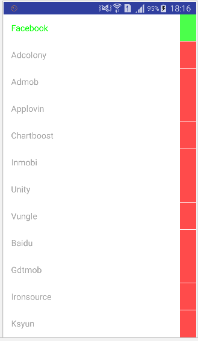
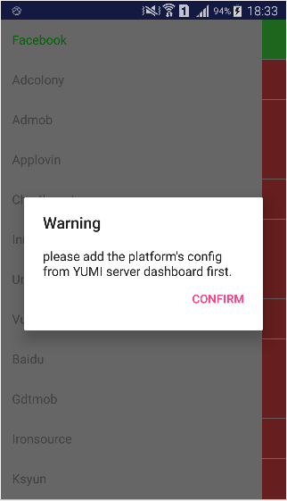

   * [YumiMediationSDK Android](#yumimediationsdk-android)
      * [1. 概述](#1-概述)
         * [1.1 面向人群](#11-面向人群)
         * [1.2 开发环境](#12-开发环境)
      * [2. 开发环境配置](#2-开发环境配置)
         * [2.1 Android-studio 接入](#21-android-studio-接入)
         * [2.2 Eclipse 接入](#22-eclipse-接入)
      * [3. 代码集成](#3-代码集成)
         * [3.1 横幅广告](#31-横幅广告)
            * [3.1.1 初始化及请求](#311-初始化及请求)
            * [3.1.2 销毁广告](#312-销毁广告)
            * [3.1.3 监听事件](#313-监听事件)
            * [3.1.4 其它方法](#314-其它方法)
         * [3.2 插屏广告](#32-插屏广告)
            * [3.2.1 初始化及请求](#321-初始化及请求)
            * [3.2.2 展示及销毁](#322-展示及销毁)
            * [3.2.3 监听事件](#323-监听事件)
            * [3.2.4 其它方法](#324-其它方法)
         * [3.3 激励视频](#33-激励视频)
            * [3.3.1 初始化及请求](#331-初始化及请求)
            * [3.3.2 展示及销毁](#332-展示及销毁)
            * [3.3.3 监听事件](#333-监听事件)
            * [3.3.4 其它方法](#334-其它方法)
         * [3.4 开屏广告](#34-开屏广告)
            * [3.4.1 初始化及请求](#341-初始化及请求)
            * [3.4.2 监听事件](#342-监听事件)
            * [3.4.3 其它方法](#343-其它方法)
         * [3.5 原生广告](#35-原生广告)
            * [3.5.1 初始化及请求](#351-初始化及请求)
            * [3.5.2 监听事件](#352-监听事件)
            * [3.5.3 展示广告](#353-展示广告)
            * [3.5.4 其它设置](#354-其它设置)
      * [4. 其它设置](#4-其它设置)
         * [4.1 混淆](#41-混淆)
         * [4.2 设置 channelID 与 versionName](#42-设置-channelid-与-versionname)
         * [4.3 GDPR](#43-gdpr)
            * [4.3.1 设置 GDPR](#431-设置-gdpr)
            * [4.3.2 支持 GDPR 的平台](#432-支持-gdpr-的平台)
      * [5. 调试模式](#5-调试模式)
         * [5.1 调用调试模式](#51-调用调试模式)
         * [5.2 测试广告位](#52-测试广告位)
      * [6. 接入常见问题](#6-接入常见问题)

# YumiMediationSDK Android

## 1. 概述

### 1.1 面向人群

当前文档面向需要在 Android 产品中接入玉米移动广告 SDK 的开发人员。
   
### 1.2 开发环境

OS: Windows, Mac, Linux <br/>
Android SDK: > 4.4(API level 19)<br/>
IDE: Eclipse with ADT (ADT version 23.0.4) OR Android-Studio<br/>
Java: > JDK 7

## 2. 开发环境配置

### 2.1 Android-studio 接入

配置聚合主包及各 Network

在项目根目录下的 build.gradle 文件中添加以下配置

```groovy
buildscript {
    repositories {
        jcenter()
    }
}

allprojets {
    repositories {
    	jcenter()

        // 可选，如果需要导入 Google Server 相关的 SDK 时需要添加以下 repo
        google()
        
        // 可选，如果需要导入 Innerative，bytedance 相关的 SDK 时需要添加以下 repo
        maven { url "https://dl.bintray.com/yumimobi/thirdparty/" }
        maven { url "https://dl.bintray.com/yumimobi/ads/" }

        // 可选，如果需要导入 Tapjoy 相关 SDK 时需要添加以下 repo
        maven { url "https://tapjoy.bintray.com/maven" }

        // 可选，如果需要导入 Pubnative 相关 SDK 时需要添加以下 repo
        maven { url "https://dl.bintray.com/pubnative/maven" }
    }
}
```

在 app 下的 build.gradle 中添加依赖相关依赖

```groovy
dependencies {
    // YumiMediationSDK main package
    implementation 'com.yumimobi.ads:mediation:4.3.0'

    // YumiMediationSDK adapters, each adapter is one third party sdk.
    implementation 'com.yumimobi.ads.mediation:playableads:4.3.0'
    implementation 'com.yumimobi.ads.mediation:adcolony:4.3.0'
    implementation 'com.yumimobi.ads.mediation:admob:4.3.0'
    implementation 'com.yumimobi.ads.mediation:applovin:4.3.0'
    implementation 'com.yumimobi.ads.mediation:baidu:4.3.0'
    implementation 'com.yumimobi.ads.mediation:bytedance:4.3.0'
    implementation 'com.yumimobi.ads.mediation:chartboost:4.3.0'
    implementation 'com.yumimobi.ads.mediation:facebook:4.3.0'
    implementation 'com.yumimobi.ads.mediation:gdt:4.3.0'
    implementation 'com.yumimobi.ads.mediation:inmobi:4.3.0'
    implementation 'com.yumimobi.ads.mediation:inneractive:4.3.0'
    implementation 'com.yumimobi.ads.mediation:ironsource:4.3.0'
    implementation 'com.yumimobi.ads.mediation:ksyun:4.3.0'
    implementation 'com.yumimobi.ads.mediation:mintegral:4.3.0'
    // If you publish an app in China, you can use mintegral-china sdk
    // compile 'com.yumimobi.ads.mediation:mintegral-china:4.3.0'
    implementation 'com.yumimobi.ads.mediation:oneway:4.3.0'
    implementation 'com.yumimobi.ads.mediation:tapjoy:4.3.0'
    implementation 'com.yumimobi.ads.mediation:unity:4.3.0'
    implementation 'com.yumimobi.ads.mediation:vungle:4.3.0'
    implementation 'com.yumimobi.ads.mediation:pubnative:4.3.0'
｝
```

> 最新版本号，请[查看](https://github.com/yumimobi/YumiMediationSDKDemo-Android#latest-version)

> 聚合平台Adapter详细说明，请[查看](./YumiMediationSDK%20-%20Mediation%20List(zh-cn)%20.md)

添加可选权限，可选权限可以提升广告填充率及广告转化效果。

```xml
<uses-permission android:name="android.permission.ACCESS_NETWORK_STATE" />
<uses-permission android:name="android.permission.ACCESS_WIFI_STATE" />
<uses-permission android:name="android.permission.MOUNT_UNMOUNT_FILESYSTEMS"/>
<uses-permission android:name="android.permission.ACCESS_FINE_LOCATION"/>
<uses-permission android:name="android.permission.ACCESS_COARSE_LOCATION" />
<uses-permission android:name="android.permission.DOWNLOAD_WITHOUT_NOTIFICATION" />
<!--此权限受 Android 系统限制，若无此权限可能导致部分机型对下载类广告无法直接下载，国内渠道必须添加，Googleplay（一般为直接跳转型广告）可不加-->
<uses-permission android:name="android.permission.WRITE_EXTERNAL_STORAGE" />
<!--此权限受 Android 系统限制，请添加，如果不添加将影响广告收益-->
<uses-permission android:name="android.permission.READ_PHONE_STATE"/>
```

 ### 2.2 Eclipse 接入

**第一步：下载并添加聚合SDK：**

>[SDK 下载列表](https://github.com/yumimobi/YumiMediationSDKDemo-Android/blob/master/docs/YumiMediationSDK%20for%20Android%20Download%20Page.md)

玉米移动广告需要的lib文件均放在 ..\YumiMobi_SDK_AndroidEclipse_Example\lib 文件夹下：

- YumiMobi_Android_vX.X.X.jar

- android-support-v4.jar

- android-support-v7-appcompat.jar

- google_play_service的lib工程

使用时在工程的根目录下创建 libs 文件夹，将 YumiMobi_Android_vX.X.X.jar 添加到创建好的 libs 文件中。


可以视需求添加 android-support-v4.jar、android-support-v7-appcompat.jar 到 libs 文件中，需要用到 V4 或 V7 包时必须使用我们提供的 jar。

<div style="background-color:rgb(228,244,253);padding:10px;">
<span style="color:rgb(62,113,167);">关于 google_play_service 工程：
google_play_service 工程非必加，部分平台广告需要 google_play_service 支持，玉米移动广告不需要添加。使用时需要将此工程作为 library 工程，添加到您的工程中。并在 manifest.xml 文件的 &lt;application&gt; 
标签内增加以下代码：</span></div>
<br/>

```xml
<meta-data 
    android:name="com.google.android.gms.version"
    class="kix-line-break"
    android:value="@integer/google_play_services_version" />
```

**第二步：注册组件**

如以jar包方式接入SDK，请在工程中的manifest.xml文件中添加：

```xml
    <receiver android:name="com.yumi.android.sdk.ads.self.module.receiver.ADReceiver">
        <intent-filter>
            <action android:name="android.intent.action.DOWNLOAD_COMPLETE" />
        </intent-filter>
    </receiver>

    <activity
        android:name="com.yumi.android.sdk.ads.self.activity.YumiFullScreenActivity"
        android:configChanges="keyboardHidden|orientation|screenSize"
        android:theme="@android:style/Theme.NoTitleBar.Fullscreen" />

    <activity
        android:name="com.playableads.presenter.APIAdActivity"
        android:configChanges="keyboardHidden|orientation|screenSize"
        android:theme="@android:style/Theme.NoTitleBar.Fullscreen" />

    <activity
        android:name="com.playableads.presenter.PlayableADActivity"
        android:configChanges="orientation|screenSize|keyboardHidden"
        android:hardwareAccelerated="true"
        android:screenOrientation="portrait"
        android:theme="@android:style/Theme.NoTitleBar.Fullscreen" />

    <activity
        android:name="com.playableads.presenter.NativeAdLandingPageActivity"
        android:configChanges="orientation|screenSize|keyboardHidden"
        android:hardwareAccelerated="true"
        android:screenOrientation="portrait"
        android:theme="@android:style/Theme.NoTitleBar.Fullscreen" />

    <activity
        android:name="com.playableads.presenter.WebActivity"
        android:configChanges="orientation|screenSize|keyboardHidden"
        android:hardwareAccelerated="true"
        android:theme="@android:style/Theme.NoTitleBar.Fullscreen" />

    <receiver android:name="com.playableads.PlayableReceiver">
        <intent-filter>
            <action android:name="android.intent.action.DOWNLOAD_COMPLETE" />
        </intent-filter>
    </receiver>
        
    <activity android:name="com.yumi.android.sdk.ads.mediation.activity.MediationTestActivity" />
```

**第三步：添加权限**

- 如以jar包方式接入SDK，请在工程中的manifest.xml中添加以下权限

```xml
<uses-permission android:name="android.permission.INTERNET"/>
<uses-permission android:name="android.permission.ACCESS_NETWORK_STATE" />
<!--此权限受 Android 系统限制，若无此权限可能导致部分机型对下载类广告无法直接下载，国内渠道必须添加，Googleplay（一般为直接跳转型广告）可不加-->
<uses-permission android:name="android.permission.WRITE_EXTERNAL_STORAGE" />
```

- 可选权限


```xml
<uses-permission android:name="android.permission.ACCESS_NETWORK_STATE" />
<uses-permission android:name="android.permission.ACCESS_WIFI_STATE" />
<uses-permission android:name="android.permission.MOUNT_UNMOUNT_FILESYSTEMS"/>
<uses-permission android:name="android.permission.ACCESS_FINE_LOCATION"/>
<uses-permission android:name="android.permission.ACCESS_COARSE_LOCATION" />
<uses-permission android:name="android.permission.DOWNLOAD_WITHOUT_NOTIFICATION" />

<!--此权限受 Android 系统限制，请添加，如果不添加将影响广告收益-->
<uses-permission android:name="android.permission.READ_PHONE_STATE"/>
```

## 3. 代码集成

### 3.1 横幅广告

#### 3.1.1 初始化及请求
```java
// 创建 YumiBanner 对象
//
// activity: 展示横幅广告的 Activity
// YOUR_SLOT_ID: 通过玉米移动平台创建的广告位 ID
// auto: 是否自动加载下一条广告
//  - true 横幅广告加载失败或展示一定时间后，自动请求并展示下一条横幅广告
//  - false 不自动加载下一条广告，需要再次调用 requestYumiBanner() 方法才能显示下一条。
YumiBanner banner = new YumiBanner(activity， "YOUR_SLOT_ID"， auto);

// 必需调用 setBannerContainer 方法将广告必需的信息传给 SDK，否则不会有广告展示
// 
// bannerContainer: 广告容器（ViewGroup），广告内容会填充到此容器中。SDK 会根据屏幕大小调整传入的容器尺寸，比如，传入的容器宽度超出屏幕宽度后，会自动缩小容器宽度并相应调整容器的高度
// AdSize: 广告样式，SDK 会根据广告样式调整容器尺寸，有以下 4 种，
//  - BANNER_SIZE_AUTO：SDK 根据屏幕大小调整容器大小，如果检测到设备是手机，则设置容器大小为 320*50；如果设备是平板，则设置容器大小为 728*90
//  - BANNER_SIZE_SMART：目前三方 Network 中只有 AdMob 支持 SMART 广告，其它 Network 会直接返回无广告。具体详情请参考 AdMob SMART_BANNER
//  - BANNER_SIZE_320X50：SDK 将容器设置为 320*50 大小
//  - BANNER_SIZE_728X90：SDK 将窗口设置为 728*90 大小
// isMatchWindowWidth: true 代表将容器扩展到与屏幕等宽（仅在竖屏有效），高度与宽度比为 1:8(BANNER_SIZE_728X90) 或 1:6.4(非 BANNER_SIZE_728X90)
banner.setBannerContainer(bannerContainer, AdSize.BANNER_SIZE_AUTO, isMatchWindowWidth);

// 请求横幅广告，如果 auto 属性设置为 true，则只需要调用一次该方法即可
banner.requestYumiBanner();
```

#### 3.1.2 销毁广告

```java
banner.destroy();
```

当不再需要展示横幅广告时销毁 banner 对象，建议在 Activity `onDestroy()` 回调方法中销毁。如果只是想暂时隐藏 Banner 广告，可以调用 `dismissBanner()` 方法，在需要再次展示时调用 `resumeBanner()` 方法来重新显示广告。

#### 3.1.3 监听事件

如果需要监听横幅广告方法回调，请在创建 YumiBanner 对象后，调用如下方法

```java
banner.setBannerEventListener(iYumiBannerListener);
```

IYumiBannerListener 接口定义如下

```java
interface IYumiBannerListener {
    // 广告加载完毕时触发此方法
    void onBannerPrepared();
    // 广告加载失败时触发此方法，打印 adError 查看错误详情
    void onBannerPreparedFailed(AdError adError);
    // 广告展示到屏幕上时触发此方法
    void onBannerExposure();
    // 点击广告时触发此方法
    void onBannerClicked();
    // 关闭广告时会触发此方法，调用 dismissBanner() 方法不会触发此方法
    void onBannerClosed();
};
```

#### 3.1.4 其它方法
```java
// 隐藏横幅，同时暂停横幅轮换请求
banner.dismissBanner();
// 恢复显示横幅，同时恢复横幅轮换请求
banner.resumeBanner();
```

### 3.2 插屏广告

#### 3.2.1 初始化及请求

```java
// 创建 YumiInterstitial 对象. 
// 
// activity: 插屏广告会在此 Activity 中展示
// YOUR_SLOT_ID: 通过玉米移动平台创建的插屏广告位 ID
// auto: 是否自动加载下一条广告
//  - true 展示插屏广告结束或获取插屏广告失败时，SDK 会在合适时机自动请求下一条插屏广告
//  - false 展示完毕插屏广告时，不会自动请求下一条插屏广告
YumiInterstitial interstitial = new YumiInterstitial(activity， "YOUR_SLOT_ID"， auto);

// 请求插屏广告，如果 auto 属性设置为 true，则只需要调用一次该方法即可
interstitial.requestYumiInterstitial();
```

<div style="background-color:rgb(228,244,253);padding:10px;">
<span style="color:rgb(62,113,167);">
<b>重要提示：</b>在展示插屏时，必须使用 interstitial.onBackPressed() 方法，避免 back 键逻辑混乱。比如，有正在显示的插屏广告时，点击 back 按键应该闭关插屏广告而不是关闭当前 Activity。示例代码如下
</span>
</div>
<br/>

```java
@Override
public void onBackPressed() {
    if (interstitial.onBackPressed()) {
        return;
    }
    super.onBackPressed();
}
```

#### 3.2.2 展示及销毁

```java
// 展示广告
interstitial.showInterstitial();
```

```java
// 销毁插屏广告实例
interstitial.destroy();
```
只有在不需要展示插屏广告时再调用 `destroy()` 方法，建议在 Activity `onDestroy()` 生命回调中调用此方法。

#### 3.2.3 监听事件

如果需要监听插屏广告方法回调，请在创建 YumiInterstitial 对象后，调用如下方法

```java
interstitial.setInterstitialEventListener(iYumiInterstitialListener);
```

IYumiInterstitialListener 接口定义如下
```java
interface IYumiInterstitialListener {
    // 插屏广告加载完毕后会触发此方法
    void onInterstitialPrepared();
    // 插屏广告加载失败时触发此方法，打印 adError 查看错误详情
    void onInterstitialPreparedFailed(AdError adError);
    // 插屏广告显示到屏幕上时触发此方法
    void onInterstitialExposure();
    // 插屏广告被点击时触发此方法
    void onInterstitialClicked();
    // 关闭插屏广告时触发此方法
    void onInterstitialClosed();
    // 调用展示插屏广告方法后，未能展示成功时触发此方法，打印 adError 查看错误详情
    void onInterstitialExposureFailed(AdError adError);
    // 当插屏中有视频时，在视频开始播放时触发此方法，如果插屏中没有视频则广告展示后触发此方法
    void onInterstitialStartPlaying();
}
```

#### 3.2.4 其它方法
```java
// 判断是否有可用广告
interstitial.isReady();
```

### 3.3 激励视频

#### 3.3.1 初始化及请求

```java
// 创建 YumiMedia 对象
//
// activity: 激励视频将在此 Activity 上展示
// YOUR_SLOT_ID: 通过玉米移动平台创建激励视频广告位 ID
YumiMedia media = new YumiMedia(activity， "YOUR_SLOT_ID");

// 请求激励视频广告，在首次调用此方法后，广告在关闭或请求失败后会自动请求下一条广告
media.requestYumiMedia();
```

#### 3.3.2 展示及销毁

展示激励视频
```java
media.showMedia();
```

销毁奖励视频对象：只有在不需要展示奖励视频广告时再调用 `destroy()` 方法，建议在 Activity `onDestroy()` 生命回调中调用此方法。
```java
media.destroy()
```

#### 3.3.3 监听事件

如果需要监听激励视频广告方法回调，请在创建 YumiMedia 对象后，调用如下方法

```java
media.setMediaEventListener(iYumiMediaListener);
```

IYumiMediaListener 接口定义如下

```java
interface IYumiMediaListener {
    // 激励视频加载完毕时触发此方法
    void onMediaPrepared();
    // 激励视频加载失败时触发此方法，打印 adError 查看错误详情
    void onMediaPreparedFailed(AdError adError);
    // 激励视频展示到屏幕时触发此方法
    void onMediaExposure();
    // 调用展示方法后，激励视频未成功展示广告时，触发此方法，打印 adError 查看错误详情
    void onMediaExposureFailed(AdError adError);
    // 点击广告时触发此方法
    void onMediaClicked();
    // 激励视频关闭时触发此方法，isRewarded 代表是否应该下发奖励，比如播放过程中选择跳过广告也会触发此关闭事件，此时 isRewarded 为 false，代表不应该下发奖励
    void onMediaClosed(boolean isRewarded);
    // 激励视频奖励回调，此时应该下发奖励（此方法与 onMediaClosed(true) 两选一，避免重复下发奖励）
    void onMediaRewarded();
    // 视频开始播放时触发此方法
    void onMediaStartPlaying();
}
```

#### 3.3.4 其它方法
```java
// 判断是否有准备就绪的广告
media.isReady();
// 返回奖励广告剩余条数，如果为 0 则代表今天不会再请求激励视频广告
media.getMediaRemainRewards()
```

<div style="background-color:rgb(228,244,253);padding:10px;">
<span style="color:rgb(62,113,167);">
<b>注意：</b>不要频繁调用 isReady() 方法，建议调用间隔时间 5 秒以上。
</span>
</div>

### 3.4 开屏广告

#### 3.4.1 初始化及请求

```java
// 创建 YumiSplash 对象
// 
// activity: 开屏广告会展示到此 activity 的 adContainer 容器中
// adContainer: 开屏广告容器（ViewGroup，建议使用 FrameLayout 作为广告容器)，广告会在此容器中显示
// YOUR_SLOT_ID: 通过玉米移动平台创建的开屏广告位 ID
YumiSplash splash = new YumiSplash(activity, adContainer, "YOUR_SLOT_ID");

// 请求并展示开屏广告
splash.loadAdAndShowInWindow();
```

#### 3.4.2 监听事件

监听开屏广告方法回调，请在创建 YumiSplash 对象后，调用如下方法

```java
splash.setSplashListener(iYumiSplashListener);
```

IYumiSplashListener 接口定义如下

```java
interface IYumiSplashListener {
    // 开屏展示成功时触发此方法
    void onSplashAdSuccessToShow();
    // 开屏未能成功展示时触发此方法，打印 adError 查看错误详情
    void onSplashAdFailToShow(AdError adError);
    // 点击开屏时触发此方法
    void onSplashAdClicked();
    // 开屏广告关闭时触发此方法
    void onSplashAdClosed();
}
```

#### 3.4.3 其它方法
```java
// 设置开屏启动图，加载开屏期间显示此图片
splash.setLaunchImage(drawable);
// 设置请求广告时长，默认为 3 秒，如果在 3 秒内未加载成功就直接触发失败回调，此处 3 秒为约数
splash.setFetchTime(seconds);
```

### 3.5 原生广告

#### 3.5.1 初始化及请求

```java
// 创建一个原生广告选项对象进行其他自定义设置，以下方式为默认样式，其它细节后续有详细说明
YumiNativeAdOptions nativeAdOptions = new YumiNativeAdOptions.Builder().build();

// 创建一个原生广告对象
//
// activity: 
// YOUR_SLOT_ID:  是在玉米后台申请的广告位 ID, nativeAdOptions 是原生广告的可选自定义设置
// nativeAdOptions: 自定义样式配置对象
YumiNative nativeAd = new YumiNative(activity, "YOUR_SLOT_ID", nativeAdOptions);

// 请求广告
// 
// adCount: 此次加载原生广告条数
nativeAd.requestYumiNative(adCount); 
```

#### 3.5.2 监听事件
监听原生广告回调方法，请在创建 YumiNative 对象后，调用如下方法
```java
nativeAd.setNativeEventListener(iYumiNativeListener);
```

IYumiNativeListener 接口定义如下
```java
interface IYumiNativeListener {
    // 原生广告加载完成时触发此方法，adList 代表加载成功了 adList.size() 条原生广告
    void onLayerPrepared(List<NativeContent> adList);
    // 原生广告加载失败时触发此方法，打印 adError 查看错误详情
    void onLayerFailed(AdError adError);
    // 点击原生广告时触发此方法
    void onLayerClick();
    // 原生广告渲染失败时触发此方法（目前只有广点通模板广告会触发此方法）
    void onExpressAdRenderFail(NativeContent content, String errorMsg);
    // 原生广告渲染成功时触发此方法（目前只有广点通模板广告会触发此方法）
    void onExpressAdRenderSuccess(NativeContent content);
    // 关闭原生广告时触发此方法（目前只有广点通模板广告会触发此方法）
    void onExpressAdClosed(NativeContent content);
}
```

#### 3.5.3 展示广告

YumiNativeAdView 类是一个 ViewGroup，开发者应将其用作原生广告的根视图。一个 YumiNativeAdView 对应于一个原生广告。凡是用于展示该广告素材资源的每个视图均应是 YumiNativeAdView 对象的子对象。

1、对于使用 LinearLayout 来展示素材资源视图的统一原生广告，其视图层次结构可能如下所示：

```xml
<?xml version="1.0" encoding="utf-8"?>
<com.yumi.android.sdk.ads.formats.YumiNativeAdView xmlns:android="http://schemas.android.com/apk/res/android"
    android:layout_width="match_parent"
    android:layout_height="wrap_content">
<LinearLayout xmlns:android="http://schemas.android.com/apk/res/android"
    android:layout_width="match_parent"
    android:layout_height="wrap_content"
    android:layout_gravity="center"
    android:background="#FFFFFF"
    android:minHeight="50dp"
    android:orientation="vertical">
    <LinearLayout
        android:layout_width="match_parent"
        android:layout_height="wrap_content"
        android:orientation="vertical"
        android:paddingLeft="20dp"
        android:paddingRight="20dp"
        android:paddingTop="12dp">
        <LinearLayout
            android:orientation="horizontal"
            ...>
            <ImageView
                android:id="@+id/app_icon"
                .../>
            <LinearLayout
                android:orientation="vertical"
                ...>
                <TextView
                    android:id="@+id/headline"
                    .../>
                <RatingBar
                    android:id="@+id/stars"
                     .../>
            </LinearLayout>
        </LinearLayout>
        // Other assets such as image or media view, call to action, etc follow.
        ...
    </LinearLayout>
</LinearLayout>
</com.yumi.android.sdk.ads.formats.YumiNativeAdView>
```

2、下面这个示例代码段创建了一个 YumiNativeAdView，然后用 NativeContent 填充该视图：

```java
private void showNativeAd() {
    // 判断原生回调 onLayerPrepared() 接口返回的广告列表是否为空
    if (adContentList != null && adContentList.size() > 0) {
        // 提取广告对象
        NativeContent content = adContentList.get(0);

        // 判断当前广告是否过期，true : 已过期；false ：未过期。
        // 如果判断为已过期，请不要展示当前广告，请求新的广告
        if(content.isExpired()){
            return;
        }

        // 获取原生广告父容器，用来显示原生广告
        FrameLayout nativeAdContinerView = (FrameLayout) findViewById(R.id.ll_ad_continer);
        // 判断当前 content 是否为模板 view
        if (content.isExpressAdView()) {
            // 如果当前 content 为模板 View，则通过 content.getExpressAdView() 获取该 View 然后添加到广告容器中
            YumiNativeAdView adView = (YumiNativeAdView) getLayoutInflater().inflate(R.layout.activity_native_material, null);
            adView.removeAllViews();

            FrameLayout.LayoutParams videoViewLayout = new FrameLayout.LayoutParams(WRAP_CONTENT, WRAP_CONTENT);
            videoViewLayout.gravity = Gravity.CENTER;

            adView.addView(content.getExpressAdView(), videoViewLayout);
            adView.setNativeAd(content);
            nativeAdContinerView.setClickable(true);
            nativeAdContinerView.addView(adView);
        } else {
            // 填充一个 XML 布局，它的最外层节点为 YumiNativeAdView
            YumiNativeAdView adView = (YumiNativeAdView) getLayoutInflater().inflate(R.layout.activity_native_material, null);

            // 将标题视图注册到 YumiNativeAdView 对象中
            adView.setTitleView((TextView) adView.findViewById(R.id.headline));

            ...
            // 请按照上面的方法，将 Icon,大图, 行动号召等视图注册到 YumiNativeAdView 对象中
            ...

            // 如果想显示视频广告，请注册显示视频的容器
            adView.setMediaLayout((FrameLayout) adView.findViewById(R.id.media_content));

            // 使用广告对象提供的字符串素材资源，给标题视图填充文字
            if (content.getTitle() != null) {
            ((TextView) adView.getHeadlineView()).setText(content.getTitle());
            }

            ...
            // 请按照上面的方法，给 Icon,大图, 行动号召等视图填充内容
            ...

            // 使用 YumiNativeAdView 对象中 setNativeAd 接口注册当前的广告对象
            adView.setNativeAd(content);

            // 确认父容器不包含 ad View
            nativeAdContinerView.removeAllViews();
            // 将 adView 添加到父容器中
            nativeAdContinerView.addView(adView);
        }
    }
}
```

3、以下是各项具体任务细节：

* 展示原生广告之前请先判断广告是否过期，代码示例如下：
```java
content.isExpired()
```
| 返回值 | 说明   | 备注                           |
| ------ | ------ | ------------------------------ |
| true   | 已过期 | 展示已过期的广告将不会产生收益 |
| false  | 未过期 | 当前广告可以展示               |

* 通过 destroy 方法销毁当前 content
```java
content.destroy() // 注意，此处为 content 对象的 destroy()，非 nativeAd 对象中的 destroy()
```

* 填充布局

```java
// 填充一个 XML 布局，它的最外层节点为 YumiNativeAdView
YumiNativeAdView adView = (YumiNativeAdView) getLayoutInflater().inflate(R.layout.activity_native_material, null);
```

在本示例中，我们要填充一个 XML 布局（该布局包含的视图用于展示原生广告），然后找到对 YumiNativeAdView 的引用。

* 填充和注册素材资源视图

下面的示例代码会找到用于显示标题的视图，使用广告对象提供的字符串素材资源设置其文字，然后向 YumiNativeAdView 对象注册该视图：

```java
// 获取标题视图
TextView headline = (TextView) adView.findViewById(R.id.headline)
// 调用 YumiNativeAdView 的 setTitleView 接口注册标题视图
adView.setTitleView(title);
if (content.getTitle() != null) {
    // 使用广告对象提供的字符串素材资源，给标题视图填充文字
    ((TextView) adView.getHeadlineView()).setText(content.getTitle());
}
```
对于应用要展示的由原生广告对象提供的每项素材资源，都应为其重复上述过程，即找到相应视图、设置其值并向广告视图类注册它。

 * 注册原生广告对象

这是最后一步，也就是向负责显示原生广告对象的视图注册该对象：

```java
adView.setNativeAd(content);
```

**原生视频**
 
1、如果您想在原生广告中展示视频，仅需要在注册视图时，在视图中预留视频容器（FrameLayout）的位置，将该容器 传入 SDK。 
 
视频容器可以在 XML 布局中定义，也可以动态构建。就像所有其他素材资源视图一样，应该将其放在 YumiNativeAdView 的视图层次结构中。对于使用视频容器的应用，不需要在其中填充素材资源，但必须向 YumiNativeAdView 注册它，如下所示：

```java
FrameLayout media_content = (FrameLayout) adView.findViewById(R.id.media_content);
adView.setMediaLayout(media_content);
```

视频容器是一个专门用于展示主媒体素材资源的 View。它具有以下行为：

* 如果加载的广告具有视频素材资源，则会对视频进行缓冲并将视频播放器放到该容器内播放。

2、通过下面的广告对象提供的接口可以判断当前广告对象是否有视频素材：

```java
content.getHasVideoContent()
```

**YumiNativeAdVideoController**

1、YumiNativeAdVideoController 类用于获取有关视频素材资源的信息。通过调用 getNativeAdVideoController() 方法，应用可以从 NativeContent 获得对该控制器的引用：

```java
YumiNativeAdVideoController nativeAdVideoController = content.getNativeAdVideoController();
```
即使广告中没有视频素材资源，此方法也会始终返回 YumiNativeAdVideoController 对象。

YumiNativeAdVideoController 提供以下视频状态查询方法：
 *  getAspectRatio() - 此方法返回视频的宽高比（宽度/高度），如果没有视频素材资源，则返回零。

2、应用也可以使用 YumiNativeAdVideoController.YumiVideoLifecycleCallbacks() 类，以便在视频素材资源生命周期内发生事件时收到通知：

```java
nativeAdVideoController.setVideoLifecycleCallbacks(
    new YumiNativeAdVideoController.YumiVideoLifecycleCallbacks() {
        @Override
        public void onVideoEnd() {
            super.onVideoEnd();
        }
    });
```

**在Activity生命周期方法中实现：**

如果不再使用当前原生对象，可以调用nativeAd.onDestroy()方法销毁nativeAd对象，例如可以在Activity的onDestroy()方法里面销毁。

```java
@Override
protected void onDestroy(){
    super.onDestroy();
    if (nativeAd != null){
        nativeAd.onDestroy();
    }
}
```

#### 3.5.4 其它设置

原生广告让您可以使用 YumiNativeAdOptions 对象进行自定义原生样式，如下：

```java
YumiNativeAdOptions nativeAdOptions = new YumiNativeAdOptions.Builder()
                .setIsDownloadImage(true)
                .setAdChoicesPosition(YumiNativeAdOptions.POSITION_TOP_RIGHT)
                .setAdAttributionPosition(YumiNativeAdOptions.POSITION_TOP_LEFT)
                .setAdAttributionText("广告")
                .setAdAttributionTextColor(Color.argb(255, 255, 255, 255))
                .setAdAttributionBackgroundColor(Color.argb(90, 0, 0, 0))
                .setAdAttributionTextSize(10)
                .setHideAdAttribution(false)
                .setHideAdAttribution(new ExpressAdSize(400, 300)) // 宽：400dp; 高：300dp
                .build();
```
* **setIsDownloadImage** 原生广告返回的 Icon 和大图资源为 Image 对象。如果 setIsDownloadImage 设置为 true，则 SDK 会自动获取图片素材资源，并为您填充 Image 对象中的 Drawable, url, scale 属性；如果 setIsDownloadImage 设置为 false, SDK 将不会自动下载 Icon 和大图的图片资源，返回的 Icon 和大图的 Image 对象只会填充 url 属性，从而允许您自行决定是否下载实际图片，默认为 true
* **setAdChoicesPosition** 使用该属性指定“广告选择”图标应放置的位置。该图标可以显示在广告的任一角，默认为 YumiNativeAdOptions.POSITION_TOP_RIGHT
* **setAdAttributionPosition** 使用该属性指定广告标识图标应放置的位置。该图标可以显示在广告的任一角，默认为 YumiNativeAdOptions.POSITION_TOP_LEFT
* **setAdAttributionText** 您可以使用该属性指定广告标识的文案。根据手机语言显示为“广告”或者“Ad”
* **setAdAttributionTextColor** 使用该属性指定广告标识的文字颜色，默认白色
* **setAdAttributionBackgroundColor** 使用该属性指定广告标识的背景颜色，默认灰色
* **setAdAttributionTextSize** 使用该属性指定广告标识的字体大小，默认10
* **setHideAdAttribution** 使用该属性指定广告标识是否隐藏，默认显示
* **setHideAdAttribution(new ExpressAdSize(width, height))** 传入原生广告容器的 ExpressAdSize(width, height)，广点通平台原生模板 View 需要设置此属性

## 4. 其它设置 

### 4.1 混淆

如果您的工程需要混淆编译， 请在混淆文件内增加以下内容。

```
-keepattributes Exceptions,InnerClasses,Signature,Deprecated,SourceFile,LineNumberTable,*Annotation*,Synthetic,EnclosingMethod
-keep class com.yumi.android.sdk.ads.** { *;}
-keep class com.playableads.**{*;}
```

<b>重要提示：</b>如果你有接入其他广告平台，请根据我们提供的三方平台文档设置三方平台混淆配置，请[查看](./YumiMediationSDK%20-%20Mediation%20List(zh-cn)%20.md)。

### 4.2 设置 channelID 与 versionName
每种广告形式都支持设置 channelID 与 versionName，以 YumiBanner 对象为例
```java
// 根据平台配置设置渠道. 重复调用以最后一次为准
banner.setChannelID(channelID);
// 根据平台配置设置版本, 重复调用以最后一次为准
banner.setVersionName(versionName);
```

<div style="background-color:rgb(228,244,253);padding:10px;">
<span style="color:rgb(62,113,167);">
<b>重要提示：</b>ChannelID 是指应用发布的渠道标识，填写后 YUMI 平台可根据渠道 ID 进行数据统计和效果分析。以 Popstar! 消灭星星官网正版为例，当游戏发布到三星渠道时，需要将 setChannelID(channelStr) 设置为 setChannelID(‘SamSung’)。渠道标识为 YUMI 平台生成信息，不可随意修改。如果没有设置 channelID 与 versionName 的需要，可以忽略此方法。
</span>
</div>

### 4.3 GDPR
本文件是为遵守欧洲联盟的一般数据保护条例（GDPR）而提供的。 自 YumiMediationSDK 4.1.0 起，如果您正在收集用户的信息，您可以使用下面提供的 API 将此信息通知给 YumiMediationSDK 和部分三方平台。更多信息请查看我们的官网。

#### 4.3.1 设置 GDPR

GDPR 状态枚举类定义

```java
enum YumiGDPRStatus {
    // 用户已授予个性化广告的同意权
    PERSONALIZED,
    // 用户已授予非个性化广告的同意权
    NON_PERSONALIZED,
    // 默认设置，用户未设置 GDPR 状态
    UNKNOWN
}
```

GDPR 相关方法
```java
// 设置 GDPR 状态
YumiSettings.setGDPRConsent(YumiGDPRStatus.PERSONALIZED);

// 获取 GDPR 状态
 YumiSettings.getGDPRStatus();
```
#### 4.3.2 支持 GDPR 的平台
YumiMediationSDK 会将 5.3.1 中设置的 GDPR 状态根据支持 GDPR 的三方平台的官方文档设置到各三方平台，开发者无需额外设置。以下是各三方平台对 GDPR 的支持状态。

|序号|平台|是否支持 GDPR|备注|
|---|---|---|---|
|1|adcolony|是|[官方文档](https://github.com/AdColony/AdColony-Android-SDK-3/wiki/GDPR#code-example)|
|2|admob|是|[官方文档](https://developers.google.com/admob/android/eu-consent#forward_consent_to_the_google_mobile_ads_sdk)|
|3|applovin|是|[官方文档](https://dash.applovin.com/docs/integration#androidPrivacySettings)|
|4|chartboost|是|[官方文档](https://answers.chartboost.com/en-us/child_article/android#gdpr)|
|5|inmobi|是|[官方文档](https://support.inmobi.com/monetize/android-guidelines/)|
|6|ineractive|是||
|7|iqzone|是||
|8|ironsource|是|[官方文档](https://developers.ironsrc.com/ironsource-mobile/android/advanced-settings/)|
|9|mintegral(-china)|是|[官方文档](http://cdn-adn.rayjump.com/cdn-adn/v2/markdown_v2/index.html?file=sdk-m_sdk-android&lang=en) |
|10|unity(-china)|是|[官方文档](https://unityads.unity3d.com/help/legal/gdpr)|
|11|vungle(-china)|是|[官方文档](https://support.vungle.com/hc/en-us/articles/360002922871-Get-Started-with-Vungle-Android-or-Amazon-SDK-v-6)|
|12|Yumi|是||
|13|ZplayAds|是||
|14|baidu|否||
|15|bytedance|否||
|16|facebook|*|请查阅 Facebook 相关[官方文档](https://developers.facebook.com/docs/audience-network/android) |
|17|gdt|否||
|18|ksyun|否||
|19|oneway|否||

## 5. 调试模式 

### 5.1 调用调试模式
玉米广告SDK为开发者提供了一个检测三方平台集成状态的调试模式，如图：


**使用步骤** 

1、调用方法打开调试页面：

YumiSettings.startDebugging(Activity, BannerSlotID, InterstitialSlotID, MediaSlotID, NativeSloatID, SplashSlotID); 

如果设置了版本、渠道，根据您在平台的配置需要设置渠道、版本调用方法打开调试页面：

YumiSettings.startDebugging (Activity, BannerSlotID, InterstitialSlotID, MediaSlotID, NativeSloatID, SplashSlotID, channelID, versionName);

2、玉米SDK将检测开发者接入的平台，并将获取到的平台展示在平台列表中，进入debug页面：



debug 页面说明：

* 如果平台名称没有在平台列表中，说明开发者没有接入此平台

* 如果平台名称为绿色，说明服务端配置了当前平台。
* 如果平台名称为灰色，说明服务端未配置当前平台。

3、如果平台名称为灰色，点击此平台，会显示警告：




4、如果平台名称为绿色，你可以点击此平台进行调试：

  1）SDK Available 为绿色时表示三方平台适配器已添加；当为红色时表示三方平台适配器未添加，回到文档添加lib文件部分检查该平台adapter是否添加

  2）Configuration present为绿色时表示三方平台适配器组件Manifest已注册；当为红色时表示三方方平台适配器组件Manifest未注册，可回到文档注册组件部分检查该平台适配器组件是否添加

  3）SDK Failed to start or No_fill 为绿色表示广告曾经展示成功过；当为红色时表示还未展示成功过广告， 可继续进行下一个步骤，如果所有步骤完成后仍为红色，请邮件联系我们：support@yumimobi.com


5、点击Fetch开始请求广告，点击Show展示广告

6、广告展示成功后检查项全部变为绿色，表示该家平台接入成功


7、应用发布前需要将调试模式注释掉。


### 5.2 测试广告位
 
| 广告类型 | Slot(Placement) ID | 备注 |
| --- | --- | --- |
| Banner | uz852t89 | 使用此test id，可以测试到YUMI、AdMob、AppLovin、Baidu、IQzone等平台的测试广告 |
| Interstitial | 56ubk22h | 使用此test id，可以测试到YUMI、AdMob、AppLovin、Baidu、IronSource、InMobi、IQzone、Unity Ads、Vungle、ZPLAYAds等平台的测试广告 |
| Rewarded Video | ew9hyvl4 | YUMI、AdMob、AppLovin、GDTMob、IronSource、InMobi、IQzone、Unity Ads、Vungle、ZPLAYAds等平台的测试广告可以使用此test id进行测试 |
| Native | dt62rndy | YUMI、AdMob、Baidu、GDTMob、Facebook等平台可以使用此test id进行测试 |
| Splash | vv7snvc5 | YUMI,Baidu,GDTMob,穿山甲 使用此test id，以上Network平台可测试到对应平台广告 |

## 6. 接入常见问题
若您在接入过程中遇到任何问题，可点击查看[常见问题解答](https://github.com/yumimobi/Developer-doc/blob/master/FAQ_latest_cn.md)。

